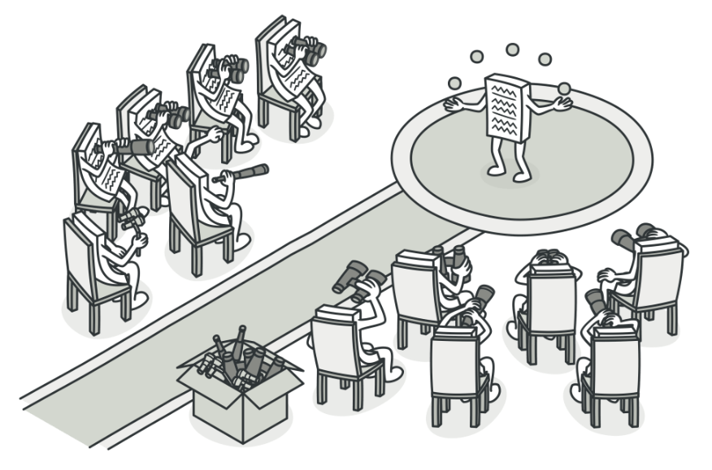
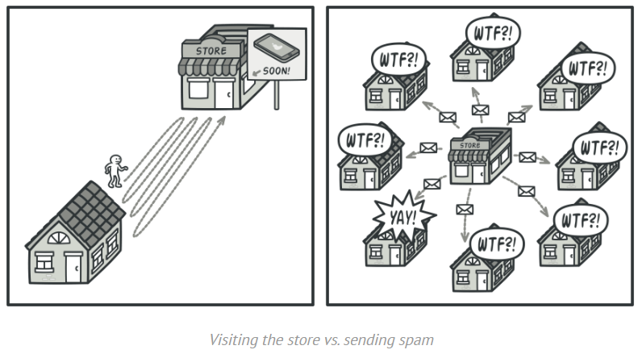
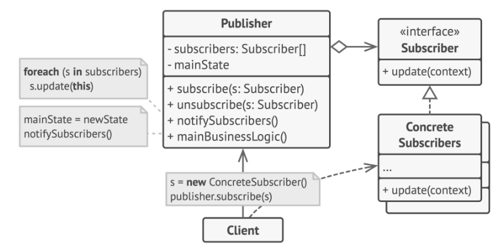

# DESING PATTERN - OBSERVER (Padrão Comportamental)
## Monitor de Mercado Financeiro 

**Nome:** Marilene Araujo  
**Disciplina:** Desenvolvimento de Sistemas  
**Instrutor:** Frederico Martins Aguiar  
**Unidade:** SENAI - Nova Lima

---
## 1. Introdução

No cenário atual da engenharia de software, a **sincronização de estados** entre componentes distintos representa um desafio crítico, especialmente em sistemas que exigem alta disponibilidade e processamento de dados em tempo real. O desenvolvimento de arquiteturas baseadas em **acoplamento rígido** frequentemente resulta em sistemas inflexíveis, onde alterações em um módulo central desencadeiam efeitos colaterais em toda a aplicação, dificultando a manutenção e a escalabilidade.

Este trabalho propõe a implementação de um **Monitor de Mercado Financeiro**, desenvolvido na linguagem **C#** com o framework **WPF** (*Windows Presentation Foundation*). A solução foca na aplicação prática de padrões de projeto para gerenciar fluxos de dados dinâmicos de maneira eficiente e organizada.

### Objetivos do Projeto

* **Implementação do Padrão Observer:** Demonstrar como a utilização deste padrão comportamental permite que um objeto central (**Sujeito**) notifique automaticamente múltiplos dependentes (**Observadores**) sobre mudanças de estado, eliminando a necessidade de verificações manuais constantes (*polling*).
* **Adoção do Padrão MVVM:** Integrar o padrão *Model-View-ViewModel* para estruturar a aplicação, garantindo que a lógica de negócio e o motor de dados permaneçam isolados da camada de apresentação.
* **Desacoplamento e Escalabilidade:** Estabelecer uma arquitetura onde novos serviços ou interfaces possam ser acoplados ao sistema sem a necessidade de modificar o código-fonte do núcleo de dados, promovendo a independência entre as camadas.
---
## 2. Definição do Padrão

O **Observer** (ou Observador) é um padrão de projeto **comportamental** que estabelece uma relação de dependência do tipo **um-para-muitos** entre objetos. O propósito central é garantir que, sempre que um objeto principal sofrer uma alteração de estado, todos os seus dependentes sejam notificados e atualizados automaticamente de forma desacoplada.

### Funcionamento do Mecanismo

O padrão é estruturado através de dois componentes fundamentais que interagem por meio de abstrações (interfaces):

  

1. **O Sujeito (Subject / Publisher):** Atua como o detentor do estado de interesse. Ele gerencia uma lista interna de observadores e disponibiliza métodos para que novos componentes possam se "inscrever" (`Subscribe`) ou "cancelar a assinatura" (`Unsubscribe`) dinamicamente em tempo de execução.
2. **O Observador (Observer / Subscriber):** Representa o componente que consome as atualizações. Em vez de monitorar o Sujeito ativamente (eliminando o consumo de recursos por *polling*), ele permanece em estado passivo até ser invocado pelo Sujeito através de um método de atualização.

### Pilares Teóricos do Padrão

* **Acoplamento Fraco (*Loose Coupling*):** O Sujeito não possui conhecimento sobre as implementações concretas dos observadores (seja uma View WPF, um serviço de log ou uma API externa). A interação ocorre estritamente via **Interface**, permitindo que o sistema evolua sem dependências rígidas.
* **Inversão de Controle:** A lógica de comunicação é invertida; em vez de a interface requisitar dados, o motor de dados "empurra" (*push*) a informação para a interface no exato momento da mudança.
* **Comunicação em *Broadcast*:** A notificação é propagada para todos os assinantes simultaneamente. O Sujeito foca exclusivamente na entrega do dado, sem se responsabilizar pelo processamento individual de cada observador.

### Representação Técnica

Para a viabilização deste padrão, define-se um contrato (Interface) que padroniza a comunicação. O método central deste contrato é:

> **`Atualizar(dados)`**: Este método atua como o ponto de entrada da notificação. Ao detectar uma mudança, o Sujeito percorre sua lista de inscritos e dispara este método para cada um deles, transmitindo o novo estado como parâmetro.
---
## 3. Problema que Resolve

A implementação do padrão **Observer** neste projeto visa mitigar três gargalos críticos no desenvolvimento de sistemas orientados a objetos: o **Acoplamento Rígido**, a **Ineficiência de Processamento (Polling)** e a **Violabilidade de Princípios de Design**.

### 3.1. Acoplamento Rígido (Dependência Direta)

Sem a aplicação do padrão, o motor financeiro (lógica de negócio) exigiria uma referência direta à classe da interface gráfica (`MainWindow`) para disparar atualizações.
* **O Problema:** Esta abordagem cria uma dependência cíclica ou rígida, onde o núcleo do sistema precisa conhecer detalhes da camada de apresentação. Caso fosse necessário adicionar um novo serviço de log ou um sistema de alertas via SMS, o código interno do motor precisaria ser modificado, violando a extensibilidade.
* **A Solução:** O Observer permite que o motor interaja estritamente com uma **Interface (`IObservadorAcoes`)**. O motor desconhece a identidade dos ouvintes, sabendo apenas que eles são capazes de processar a notificação recebida.

### 3.2. Polling vs. Push (Otimização de Recursos)

  

* **Abordagem Ineficiente (Polling):** A interface gráfica executaria um laço de repetição constante consultando o motor: *"O preço mudou?"*. Na maioria das iterações, a resposta seria negativa, resultando em desperdício de ciclos de CPU e memória.
* **Abordagem Reativa (Push):** Com o Observer, a interface permanece em estado de espera. O motor assume a responsabilidade de "empurrar" (*push*) a informação somente quando ocorre uma alteração real no estado. Esta inversão economiza recursos computacionais e simplifica o fluxo de execução.

### 3.3. Violação do Princípio de Responsabilidade Única (SRP)

* **O Problema:** Sem o padrão, a classe `MotorMercado` acabaria acumulando responsabilidades alheias ao seu propósito, como gerenciar instâncias de UI, formatar strings para exibição ou controlar conexões de persistência.
* **A Solução:** O motor foca exclusivamente em sua regra de negócio: **processar variações de mercado**. A responsabilidade sobre como essa informação será renderizada ou armazenada é delegada aos observadores concretos, mantendo o código modular e limpo.

### 3.4. Sincronização de Múltiplos Interessados

Em sistemas de monitoramento financeiro, é comum que diversos componentes (Gráficos, Grids de Cotação, Alertas de Limite) dependam do mesmo fluxo de dados.
* **O Problema:** Garantir a consistência visual entre múltiplos componentes de forma manual é complexo e propenso a falhas de sincronia.
* **A Solução:** Como todos os componentes se inscrevem no mesmo **Sujeito**, o padrão assegura a **integridade e a simultaneidade da informação** em toda a aplicação no exato instante da notificação.
---
## 4. Estrutura e Diagrama de Classes

A arquitetura deste projeto foi desenhada para separar completamente a lógica de geração de dados da lógica de exibição. Abaixo, detalhamos como o padrão **Observer** organiza as classes.

  

### 4.1. O Diagrama de Classes
O diagrama abaixo representa a relação de dependência entre as classes do sistema. Note que o "Motor" (Subject) não conhece as "ViewModels" (Observers) diretamente, mas sim a interface que elas implementam.
#INSERIR DIAGRAMA AQUI!!!

### 4.2. Fluxo de Relacionamento
1.  **Associação de Composição:** O `MotorMercado` possui uma `List<IObservadorAcoes>`. Isso permite que ele armazene múltiplos interessados sem saber de que tipo eles são (se são telas, logs ou serviços de e-mail).
2.  **Realização de Interface:** A classe `MonitorAcoesViewModel` realiza (implementa) a interface `IObservadorAcoes`. Isso garante que ela possua o método `Atualizar()`, que será chamado pelo motor.
3.  **Dependência de Dados:** Tanto o Sujeito quanto o Observador dependem da classe de modelo `Acao`, que serve como o "pacote" de dados trafegado durante a notificação.

### 4.3. Dinâmica de Execução (Diagrama de Sequência)
O funcionamento ocorre em três etapas principais:
* **Inscrição:** Ao iniciar a aplicação, a `ViewModel` chama o método `Motor.Inscrever(this)`.
* **Mudança de Estado:** O `MotorMercado` altera o preço de uma ação (via Timer).
* **Notificação:** O Motor percorre sua lista interna e executa o método `Atualizar(acao)` de cada observador inscrito.
  # INSERIR DIAGRAMA AQUI!
---
## 5. Participantes do Padrão

O padrão Observer define quatro participantes principais que colaboram para realizar o desacoplamento do sistema. Abaixo, detalhamos cada um deles e como eles se traduzem no projeto de **Monitoramento de Ações**:

### 1. Sujeito (Subject / Publisher)
* **Papel:** É o objeto que detém o estado de interesse (os preços das ações) e mantém a lista de observadores.
* **Responsabilidades:** Fornecer uma interface para anexar (`Subscribe`) e desanexar (`Unsubscribe`) observadores, além de percorrer a lista para enviar notificações.
* **No Projeto:** É a classe `MotorMercado`.

### 2. Interface do Observador (Observer / Subscriber)
* **Papel:** Define o contrato de atualização para os objetos que devem ser notificados pelo Sujeito.
* **Responsabilidades:** Declarar o método de notificação (geralmente chamado de `Update` ou `Atualizar`) que o Sujeito utilizará para passar as informações.
* **No Projeto:** É a interface `IObservadorAcoes`.

### 3. Observador Concreto (Concrete Observer)
* **Papel:** Mantém uma referência ao Sujeito e implementa a interface do Observador para manter seu estado sincronizado com o do Sujeito.
* **Responsabilidades:** Implementar a lógica de reação ao receber um dado (ex: atualizar um gráfico ou uma propriedade na tela).
* **No Projeto:** É a classe `MonitorAcoesViewModel`.

### 4. Objeto de Dados / Estado (Concrete State)
* **Papel:** Representa a informação que está sendo transmitida do Sujeito para os Observadores.
* **Responsabilidades:** Carregar os valores alterados (Símbolo da ação, Preço, Variação) de forma íntegra.
* **No Projeto:** É a classe (ou record) `Acao`.
  
---
## 6. Justificativa da Escolha do Contexto (Mercado Financeiro)

A escolha do **Mercado Financeiro** como cenário para este projeto não foi arbitrária; ela baseia-se na natureza intrínseca dos dados financeiros, que exigem alta reatividade e integridade. Abaixo, detalhamos os motivos técnicos que tornam este contexto o "caso de uso perfeito" para o padrão Observer:

### 6.1. Natureza Crítica do Tempo (Real-Time)
No mercado de ações, a informação perde valor rapidamente. Um atraso de poucos segundos na atualização de um preço pode resultar em decisões erradas. O padrão Observer permite que o sistema seja **reativo**: em vez de a interface "perguntar" ao banco de dados se o preço mudou (o que seria lento e custoso), o motor de dados "empurra" a informação no exato milissegundo em que ela é alterada.

### 6.2. Necessidade de Múltiplas Visualizações
Em um terminal financeiro real, um único dado (ex: o preço da PETR4) precisa atualizar simultaneamente:
1. Um **Gráfico de Candlestick** (visual).
2. Uma **Grade de Cotações** (tabela).
3. Um **Sistema de Alertas** (notificação de preço alto/baixo).
4. Um **Log de Transações** (histórico).

O Observer resolve isso perfeitamente, pois o motor (Sujeito) apenas emite o dado uma vez, e todos esses componentes (Observadores) reagem de forma independente.

### 6.3. Escalabilidade e Desacoplamento
Sistemas financeiros são modulares. Hoje o sistema tem uma grade de preços; amanhã pode precisar de um robô de investimentos (*Trading Bot*). Com o Observer, podemos adicionar esse robô como um novo "Assinante" sem precisar alterar uma única linha de código do Motor de Mercado. Isso respeita o **Princípio Aberto/Fechado (OCD)** do SOLID.

### 6.4. Eficiência de Recursos (Push vs. Pull)
Se tivéssemos 10 janelas abertas e cada uma fizesse uma requisição por segundo ao motor (modelo *Pull*), teríamos um tráfego desnecessário. No modelo do Observer (*Push*), o tráfego só acontece quando há uma mudança real no dado, economizando processamento e memória, o que é vital para aplicações desktop em C#/WPF.

---

## 7. Explicação da Implementação no Projeto

Nesta seção, detalhamos como o código desenvolvido no **Rider** traduz os conceitos teóricos do padrão Observer para uma aplicação funcional em **C#** e **WPF**.

### 7.1. Camada Model
A classe `Acao` atua como o **Objeto de Dados (DTO)**. Sua função é puramente carregar a informação que será transportada do motor para os observadores.
* **Implementação:** Utilizamos o tipo `record` do C# para garantir a **imutabilidade**. Isso evita que um observador altere acidentalmente o dado antes que outros observadores o recebam.
* **Propriedades:** Contém `Simbolo` (identificador da empresa) e `Preco` (valor atualizado).

### 7.2. O Sujeito (Motor do Mercado)
A classe `MotorMercado` é a detentora do estado e a fonte das notificações.
* **Gerenciamento de Assinantes:** Possui uma `List<IObservadorAcoes>` privada. O motor não sabe quais classes estão na lista, apenas que todas seguem o contrato da interface.
* **Métodos Principais:** `Inscrever()` adiciona novos interessados à lista; `Notificar()` percorre a lista e dispara o evento.
* **O Gatilho:** Um `System.Timers.Timer` simula a volatilidade do mercado. A cada "tick" do cronômetro, um novo preço é gerado e o método `Notificar()` é acionado.

### 7.3. A Interface do Observador
A interface `IObservadorAcoes` é o componente que viabiliza o **Baixo Acoplamento**.
* **O Contrato:** Define o método `void Atualizar(Acao acao)`. 
* **Inversão de Dependência:** O motor depende desta abstração e não de classes concretas. Isso permite que amanhã possamos adicionar um "Robô de Investimento" ou um "Gerador de Logs" como observadores sem mudar uma única linha de código no motor.

### 7.4. O Observador Concreto (ViewModel)
A `MonitorAcoesViewModel` é a classe que reage aos dados e os prepara para a visão (View).
* **Ligação com o Sujeito:** No construtor, a ViewModel recebe a instância do motor e executa o registro: `_motor.Inscrever(this)`.
* **Atualização da UI:** Ao receber a notificação no método `Atualizar`, a ViewModel utiliza o `Dispatcher` do WPF. Isso é fundamental, pois as notificações vêm de uma thread secundária (Timer) e a interface gráfica só pode ser manipulada pela thread principal.
* **Data Binding:** Após processar o dado, ela dispara o `OnPropertyChanged`, fazendo com que o valor apareça instantaneamente na tela do usuário.
  
---
## 8. Integração MVVM e Boas Práticas

A implementação do padrão **Observer** ganha escala e robustez ao ser integrada à arquitetura **MVVM** (*Model-View-ViewModel*), padrão de ouro para aplicações desktop em C# e WPF. Abaixo, detalhamos como essa integração ocorre e quais boas práticas foram aplicadas:

### 8.1. Sincronização de Threads com Dispatcher
Como o `MotorMercado` (Sujeito) opera em uma thread secundária (Timer) para evitar o travamento da interface (*UI Freeze*), surge um desafio técnico: o WPF não permite que threads externas modifiquem elementos visuais.
* **Solução:** No método `Atualizar` da ViewModel, utilizamos o **`Dispatcher.Invoke`**. Ele atua como um "despachante" que envia a atualização do dado para a fila da thread principal (UI Thread), garantindo estabilidade e fluidez na atualização dos preços em tempo real.

### 8.2. Data Binding e Notificação de Propriedades
A ViewModel, ao atuar como um **Observador Concreto**, recebe o objeto `Acao` e atualiza suas propriedades locais. 
* **Boas Práticas:** Utilizamos a interface `INotifyPropertyChanged`. Assim que o Observer "avisa" a ViewModel que o preço mudou, a ViewModel "avisa" o XAML (View) via Binding, mantendo a tela sempre sincronizada sem código de manipulação direta de componentes (Code-behind limpo).

### 8.3. Princípios SOLID Aplicados
* **Single Responsibility Principle (SRP):** O Motor de Mercado apenas gera dados; ele não sabe como eles são exibidos. A ViewModel apenas formata os dados para a tela; ela não sabe como os preços são calculados.
* **Open/Closed Principle (OCP):** O sistema está aberto para extensão (podemos adicionar novos gráficos ou logs como novos observadores) e fechado para modificação (não precisamos mexer no código do `MotorMercado` para adicionar essas novas funcionalidades).
* **Dependency Inversion Principle (DIP):** O Sujeito depende da interface `IObservadorAcoes` e não de classes concretas, o que facilita a criação de testes unitários e a manutenção do código.

### 8.4. Gerenciamento de Memória (Unsubscribe)
Uma boa prática implementada é garantir o descarte correto. Quando uma janela de monitoramento é fechada, a ViewModel invoca o método de **cancelamento de assinatura** no Sujeito. Isso evita o vazamento de memória (*Memory Leak*), impedindo que o motor continue tentando notificar um objeto que não deveria mais existir na memória.

---
## 9. Análise Crítica

A aplicação do padrão Observer no Monitor de Mercado Financeiro permite uma avaliação sobre a viabilidade e o impacto da arquitetura no ciclo de vida do software. Abaixo, detalhamos os pontos observados durante o desenvolvimento:

### 9.1. Comparação: Com Padrão vs. Sem Padrão

| Característica | Sem o Padrão Observer | Com o Padrão Observer |
| :--- | :--- | :--- |
| **Acoplamento** | **Rígido:** O Motor de Mercado precisaria ter uma referência direta para cada janela (View) ou ViewModel. | **Fraco:** O Motor conhece apenas uma Interface (`IObservadorAcoes`). |
| **Escalabilidade** | **Difícil:** Para adicionar um novo gráfico, seria necessário alterar e recompilar o código do Motor. | **Fácil:** Basta criar uma nova classe que implemente a interface e "assinar" o motor. |
| **Manutenção** | **Arriscada:** Mudanças na interface gráfica poderiam quebrar a lógica de negócio do motor. | **Segura:** As camadas são independentes; a lógica de negócio está protegida da UI. |
| **Fluxo de Dados** | **Pull (Busca):** A UI precisa perguntar ao motor se o dado mudou (desperdício de CPU). | **Push (Envio):** O motor envia o dado no exato momento da mudança (eficiência). |

### 9.2. Vantagens Observadas

* **Extensibilidade (OCP):** Durante o desenvolvimento, ficou claro que poderíamos adicionar um sistema de "Log de Arquivo" ou um "Alerta Sonoro" como novos observadores sem tocar em uma linha de código do `MotorMercado`.
* **Reatividade Instantânea:** A percepção de atualização na interface WPF é imediata, essencial para o contexto financeiro onde milissegundos importam.
* **Código Limpo:** A separação de responsabilidades facilitou a leitura do código, deixando claro onde termina a regra de negócio e onde começa a lógica de exibição.

### 9.3. Desvantagens e Limitações

* **Complexidade Inicial:** Para um projeto simples, o Observer introduz mais classes e interfaces do que uma solução direta, o que exige maior esforço inicial de design.
* **Risco de Memory Leaks:** Se o desenvolvedor esquecer de chamar o método de "cancelamento de assinatura" (`Unsubscribe`) ao fechar uma janela, o motor continuará mantendo uma referência para um objeto que deveria ter sido destruído, impedindo a limpeza pelo *Garbage Collector*.
* **Ordem de Notificação:** O padrão não garante a ordem em que os observadores serão notificados. Se a lógica depender de que o "Observador A" receba a notícia antes do "Observador B", o Observer sozinho não resolve o problema.

  ---
  
## 10. Exemplos Reais de Uso no Mercado

O padrão **Observer** é um dos mais utilizados na indústria de software, servindo de base para arquiteturas reativas e sistemas distribuídos. Abaixo, listamos exemplos clássicos de sua aplicação no mercado real:

### 10.1. Notificações Push (Mobile)
Este é o exemplo mais comum no cotidiano. Quando um servidor de notícias (Sujeito) publica uma nova matéria, ele não sabe quais usuários estão com o celular ligado. Ele simplesmente dispara uma notificação para todos os aparelhos inscritos (Observadores). Cada aplicativo reage à sua maneira: exibindo um banner, vibrando o celular ou emitindo um som.

### 10.2. Dashboards Financeiros e de BI
Plataformas como **Bloomberg Terminal**, **ProfitChart** ou painéis de **Business Intelligence (Power BI)** utilizam o Observer para atualizar gráficos em tempo real. Quando o banco de dados recebe uma nova transação, todos os widgets (velas de gráfico, tabelas de volume, indicadores de média móvel) são notificados simultaneamente para redesenhar a interface.

### 10.3. Frameworks de Front-end (React, Vue, Angular)
A "mágica" desses frameworks modernos baseia-se no conceito de **Reatividade**. Quando o estado de uma variável muda, todos os componentes da página que dependem dessa variável (os Observadores) são "avisados" para se renderizarem novamente. O mecanismo de *Data Binding* do próprio **WPF** (utilizado neste projeto) é uma implementação profunda do padrão Observer.

### 10.4. Redes Sociais
No **Instagram** ou **X (Twitter)**, quando você segue alguém, você está se tornando um "Assinante" (Subscriber) daquele perfil. Assim que o perfil posta um novo conteúdo (Evento), o sistema notifica todos os seguidores (Observadores) para que o feed de cada um seja atualizado com a nova publicação.

### 10.5. Sistemas de Monitoramento (DevOps)
Ferramentas como **Zabbix** ou **Grafana** monitoram a saúde de servidores. Se o uso de CPU de um servidor ultrapassa 90%, o motor de monitoramento (Sujeito) dispara alertas para diversos observadores: um canal no **Slack**, um e-mail para o administrador e um log de segurança.

---
## 11. Conclusão

A realização deste projeto permitiu uma compreensão profunda de como padrões de projeto comportamentais, especificamente o **Observer**, são fundamentais para a criação de sistemas reativos e de alta performance. Através da implementação de um **Monitor de Mercado Financeiro**, foi possível observar na prática a transição de um sistema acoplado para uma arquitetura modular e escalável.

### Principais Aprendizados:
* **Desacoplamento Efetivo:** A utilização de interfaces (`IObservadorAcoes`) provou que o motor de dados não precisa conhecer os detalhes da interface gráfica para funcionar, o que facilita a manutenção a longo prazo.
* **Poder da Reatividade:** No contexto de WPF e MVVM, o padrão Observer, aliado ao `Dispatcher`, demonstrou ser a solução ideal para lidar com atualizações em tempo real vindas de threads secundárias sem comprometer a experiência do usuário.
* **Qualidade de Software:** A aplicação dos princípios **SOLID** durante o desenvolvimento não apenas organizou o código, mas também preparou a aplicação para futuras expansões, como a adição de novos tipos de análise técnica ou bots de negociação.

Em suma, o padrão Observer não é apenas uma técnica de codificação, mas uma mentalidade de design que prioriza a flexibilidade e a eficiência. Este projeto consolida o conhecimento necessário para enfrentar desafios reais de engenharia de software, onde a distribuição de informação precisa e oportuna é o diferencial entre um sistema funcional e uma aplicação de sucesso.

---
## 12. Referências Bibliográficas

As fontes abaixo serviram de base teórica e técnica para a fundamentação e implementação deste projeto:

### Livros e Literatura Base
* **GAMMA, Erich; HELM, Richard; JOHNSON, Ralph; VLISSIDES, John.** *Design Patterns: Elements of Reusable Object-Oriented Software*. 1. ed. Boston: Addison-Wesley, 1994. (O livro clássico do "GoF" que consolidou o padrão Observer).
* **FREEMAN, Eric; ROBSON, Elisabeth.** *Use a Cabeça! Padrões de Projetos*. 2. ed. Rio de Janeiro: Alta Books, 2023. (Abordagem prática e visual sobre a comunicação entre objetos).
* **MARTIN, Robert C.** *Clean Architecture: A Craftsman's Guide to Software Structure and Design*. 1. ed. Prentice Hall, 2017. (Fundamentos sobre desacoplamento e limites arquiteturais).

### Documentação Técnica e Frameworks
* **MICROSOFT LEARN.** *Observer Design Pattern in .NET*. Disponível em: [https://learn.microsoft.com/en-us/dotnet/standard/design-patterns/observer-design-pattern](https://learn.microsoft.com/en-us/dotnet/standard/design-patterns/observer-design-pattern). Acesso em: 21 mar. 2026.
* **MICROSOFT LEARN.** *WPF Data Binding Overview*. Disponível em: [https://learn.microsoft.com/en-us/dotnet/desktop/wpf/data/data-binding-overview](https://learn.microsoft.com/en-us/dotnet/desktop/wpf/data/data-binding-overview). Acesso em: 21 mar. 2026.
* **REFACTORING GURU.** *Observer Pattern*. Disponível em: [https://refactoring.guru/design-patterns/observer](https://refactoring.guru/design-patterns/observer). Acesso em: 21 mar. 2026.

### Ferramentas Utilizadas
* **IDE:** JetBrains Rider / Microsoft Visual Studio 2022.
* **Linguagem:** C# 12 (.NET 8/9).
* **Interface:** Windows Presentation Foundation (WPF).
